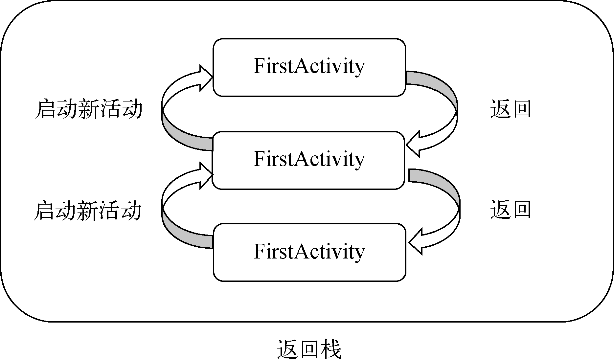
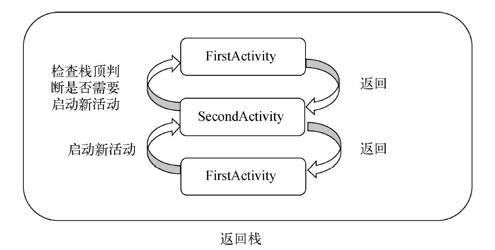
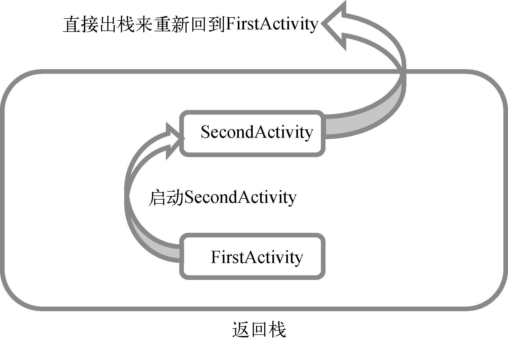
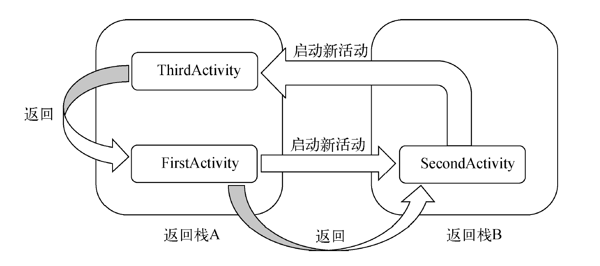

## Activity

Activity 是一种可以包含用户界面的组件，主要用于和用户进行交互，一个应用程序中可以包含零个或者多个 Activity。

### 获取在布局文件中定义的元素

通过 `findViewById()` 

```kotlin
val button1: Button = findViewById(R.id.button1)
```

Kotlin 编写的 Android 项目在 `app/build.gradle` 文件头部默认引入了一个 `kotlin-android-extensions` 插件，这个插件会根据布局文件中定义的控件 id 自动生成一个具有相同名称的变量。在 Activity 中可以直接使用这个变量。

```kotlin
import androidx.appcompat.app.AppCompatActivity
import android.os.Bundle
import android.widget.Toast
import kotlinx.android.synthetic.main.first_layout.*

class FirstActivity : AppCompatActivity() {

    override fun onCreate(savedInstanceState: Bundle?) {
        super.onCreate(savedInstanceState)
        setContentView(R.layout.first_layout)
        button1.setOnClickListener {
            Toast.makeText(this, "You clicked Button1", Toast.LENGTH_SHORT).show()
        }
    }
}
```

### 调用 Java Bean 结构的方法时简便写法

```kotlin
override fun onCreateOptionsMenu(menu: Menu?): Boolean {
    // menuInflater 为 调用 getMenuInflater() 获得的 MenuInflater 对象
    menuInflater.inflate(R.menu.main, menu)
    return true
}
```

Kotlin 中可以直接用 `.` 属性名的方式获取属性值，会自动转换成 getter 调用。设值同理，会自动转换为 setter 调用。

## 使用 Intent

Intent 是 Android 程序中各组件之间进行交互的一种重要方式。可以指明当前组件想要执行的动作，还可以在不同组件之间发传递数据。Intent 一般可以用于启动 Activity、启动 Service 以及发送广播等场景。

大致可以分为两种：显式 Intent、隐式 Intent

只有 `<action> `、`<category>` 中的内容同时匹配 Intent 中指定的 action 和 category 是，这个 Activity 才能相应该 Intent。

每个 Intent 中只能指定一个 action，可以指定多个 category 。

## Activity 的生命周期

Android 是使用任务（Task）来管理活动的，一个任务就是一组存放在栈里的 Activity 的集合，这个栈也被称作**返回栈（Back Stack）**。

### Activity 状态

每个活动在其生命周期中最多可能会有4 种状态。

- 运行状态

  当活动位于返回栈的栈顶时就处于这种状态，系统最不愿意回收的活动。

- 暂停状态

  当活动不再处于栈顶位置，但仍然可见时。因为并不是每一个活动都会占满整个屏幕。处于暂停状态的活动仍然是完全存活着的，系统也不愿意去回收这种活动。内存极低时系统才会考虑。

- 停止状态

  当一个活动不再处于栈顶位置，并且完全不可见的时候。系统仍然会为这种活动保存相应的状态和成员变量，但是这并不是完全可靠的，当其他地方需要内存时，处于停止状态的活动有可能会被系统回收。

- 销毁状态

  当一个活动从返回栈中移除后就变成了销毁状态。系统会最倾向于回收处于这种状态的活动。

### Activity 的生存期

Activity 类中定义了7 个回调方法，覆盖了 Activity 生命周期的每一个环节。

- `onCreate()`

  在 Activity 第一次被创建的时候调用。在这个方法中完成活动的初始化操作，比如说加载布局、绑定事件等。

- `onStart()`

  在 Activity 由不可见变为可见的时候调用。在这个方法中加载资源。

- `onResume()`

  在 Activity 准备好和用户进行交互的时候调用。此时的 Activity 一定位于返回栈的栈顶，并且处于运行状态。

- `onPause()`

  在系统准备去启动或者恢复另一个 Activity 的时候调用。通常会在这个方法中将一些消耗 CPU 的资源释放掉，以及保存一些关键数据，但这个方法的执行速度一定要快，不然会影响到新的栈顶 Activity 的使用。

- `onStop()`

  在 Activity 完全不可见的时候调用。它和 `onPause()` 方法的主要区别在于，如果启动的新活动是一个对话框式的活动，那么 `onPause()` 方法会得到执行，而 `onStop()` 方法并不会执行。

- `onDestroy()`

  在 Activity 被销毁之前调用，之后活动的状态将变为销毁状态。
  
- `onRestart()`

  在 Activity  由停止状态变为运行状态之前调用，也就是 Activity 被重新启动了。

以上 7 个方法中除了 `onRestart()` 方法，其他都是两两相对的，从而又可以将活动分为 3 种**生存期**。

- 完整生存期

  活动在 `onCreate()` 方法和 `onDestroy()` 方法之间所经历的。一般情况下，一个 Activity 会在 `onCreate()` 方法中完成各种初始化的操作，在 `onDestroy()` 方法中完成释放内存的操作。

- 可见生存期

  活动在 `onStart()` 方法和 `onStop()` 方法之间所经历的。在可见生存期内，Activity 对用户总是可见的。一般在 `onStart()` 方法中对资源进行加载，在 `stop()` 方法中对资源进行释放。

- 前台生存期

  活动在 `onResume()` 方法和 `onPause()` 方法之间所经历的。在前台生存期内，Activity 总是处于运行状态的。


### Activity 被回收了时如何恢复数据

Activity 中还提供了一个 `onSaveInstanceState()` 回调方法，这个方法可以保证在 Activity 被回收之前一定会被调用，因此我们可以通过这个方法来解决问题。

Bundle 提供了一系列的方法用于保存数据。

`onCreate()` 方法中的 Bundle 类型的参数会带有之前所保存的全部数据，取值恢复即可。

Intent 还可以结合 Bundle 一起用于传递数据，首先可以把需要传递的数据都保存在 Bundle 对象中，然后再将 Bundle 对象存放在 Intent 里。到了目标活动之后先从 Intent 中取出 Bundle，再从 Bundle 中一一取出数据。

## Activity 的启动模式

启动模式一共有4 种，分别是 **standard**、**singleTop**、**singleTask** 和 **singleInstance**，可以在`AndroidManifest.xml`中通过给`<activity>`标签指定`android:launchMode`属性来选择启动模式。

### standard

standard 是 Activity 默认的启动模式，在不进行显式指定的情况下，所有 Activity 都会自动使用这种启动模式。每当启动一个新的 Activity，它就会在返回栈中入栈，并处于栈顶的位置。对于使用 standard 模式的 Activity，系统不会在乎这个 Activity 是否已经在返回栈中存在，每次 Activity 都会创建该活动的一个新的实例。



### singleTop

当活动的启动模式指定为 singleTop，在启动 Activity 时如果发现返回栈的栈顶已经是该 Activity，则认为可以直接使用它，不会再创建新的 Activity 实例。未处于栈顶位置时，还是会创建新的实例的。

```xml
<activity
    android:name=".FirstActivity"
    android:launchMode="singleTop"
    android:label="This is FirstActivity">
    <intent-filter>
        <action android:name="android.intent.action.MAIN" />
        <category android:name="android.intent.category.LAUNCHER" />
    </intent-filter>
</activity>
```



### singleTask

每次启动该 Activity 时系统首先会在返回栈中检查是否存在该 Activity 的实例，如果发现已经存在则直接使用该实例，并把在这个 Activity 之上的所有活动统统出栈，如果没有发现就会创建一个新的 Activity 实例。



### singleInstance

指定为 singleInstance 模式的 Activity 会启用一个新的返回栈来管理这个 Activity（其实如果 singleTask 模式指定了不同的 taskAffinity，也会启动一个新的返回栈）。



## Activity 的最佳实践

### 知晓当前是在那一个 Activity

通过抽象出 BaseActivity，来日志打印出类名，从而容易判断出是哪一个活动。

Kotlin 中的 `javaClass` 表示获取当前实例的 Class 对象，相当于在 Java 中调用 `getClass()`。

Kotlin 中的 `BaseActivity::class.java` 表示获取 BaseActivity 类的 Class 对象，相当于在 Java 中调用 `BaseActivity.class`。

### 随时随地退出程序

通过 BaseActivity、ActivityCollector 来掌控所有活动的管理。

```kotlin
object ActivityCollector {

    private val activities = ArrayList<Activity>();

    fun addActivity(activity: Activity) {
        activities.add(activity)
    }

    fun removeActivity(activity: Activity) {
        activities.remove(activity)
    }

    fun finishAll() {
        for (activity in activities) {
            if (!activity.isFinishing) {
                activity.finish()
            }
        }
        activities.clear()
    }

}

@SuppressLint("Registered")
open class BaseActivity : AppCompatActivity() {

    override fun onCreate(savedInstanceState: Bundle?) {
        super.onCreate(savedInstanceState)
        Log.d("BaseActivity", javaClass.simpleName)
        ActivityCollector.addActivity(this)
    }

    override fun onDestroy() {
        super.onDestroy()
        ActivityCollector.removeActivity(this)
    }
}

class ThirdActivity : BaseActivity() {

    override fun onCreate(savedInstanceState: Bundle?) {
        super.onCreate(savedInstanceState)
        Log.d("ThirdActivity", "Task is is $taskId")
        setContentView(R.layout.third_layout)

        button3.setOnClickListener {
            ActivityCollector.finishAll()
            // kill 当前进程
            // killProcess() 只能用于杀掉当前程序的进程 不能用于杀掉其他程序
            android.os.Process.killProcess(android.os.Process.myPid())
        }
    }
}
```

### 启动 Activity 的最佳写法

为自己负责的活动编写 `actionStart` 方法，方便别人启动以及知悉必要参数。

```kotlin
class SecondActivity : BaseActivity() {
    ...
    companion object {
        fun actionStart(context: Context, data1: String, data2: String) {
            val intent = Intent(context, SecondActivity::class.java)
            intent.putExtra("param1", data1)
            intent.putExtra("param2", data2)
            context.startActivity(intent)
        }
    }
}
```

Kotlin 规定，所有定义在 `companion object` 中的方法都可以使用类似于 Java 静态方法调用的形式调用。

## Kotlin : 标准函数和静态方法

### 标准函数 with、run、apply

之前已经提到了 let 这个标准函数，它的主要作用就是配合 `?.` 操作符来进行辅助判空处理。

#### with

with 函数接收两个参数：第一个参数可以是一个任意类型的对象，第二个参数是一个 Lambda 表达式。

with 函数会在 Lambda 表达式中提供第一个参数对象的上下文，并使用 Lambda 表达式中的最后一行代码最为返回值返回。

```kotlin
val result = with(obj) {
    // 这里是 obj 的上下文
    "value" // with 函数的返回值
}
```

```kotlin
val list = listOf("Apple", "Banana", "Orange", "Pear", "Grape")
val result = with(StringBuilder()) {
    append("Start eating fruits.\n")
    for (fruit in list) {
        append(fruit).append("\n")
    }
    append("Ate all fruits.\n")
    toString()
}
println(result)
```

#### run

run 函数的用法和 with 函数非常类似，只是有一些语法改动。run 函数不能直接调用，一定要调用某个对象的 run 函数才可以；其次 run 函数只接收一个 Lambda 参数， 并且会在 Lambda 表达式中提供调用对象的上下文。其他与 with 函数相同。

```kotlin
val result = obj.run {
    // 这里是 obj 的上下文
    "value" // run 函数的返回值
}
```

```kotlin
val list = listOf("Apple", "Banana", "Orange", "Pear", "Grape")
val result = StringBuilder().run {
    append("Start eating fruits.\n")
    for (fruit in list) {
        append(fruit).append("\n")
    }
    append("Ate all fruits.\n")
    toString()
}
println(result)
```

#### apply

apply 函数与 run 函数也非常类似的，都是在某个对象上调用，接收一个 Lambda 参数，并且会在 Lambda 表达式中提供调用对象的上下文。区别在于 apply 函数无法指定返回值，而是会自动返回调用对象本身。

```kotlin
val result = obj.apply {
    // 这里是 obj 的上下文
}
// result == obj
```

```kotlin
val list = listOf("Apple", "Banana", "Orange", "Pear", "Grape")
val result = StringBuilder().apply {
    append("Start eating fruits.\n")
    for (fruit in list) {
        append(fruit).append("\n")
    }
    append("Ate all fruits.\n")
}
println(result.toString())
```

### 定义静态代码

Kotlin 极度弱化了静态方法这个概念，因为提供了更好的语法特性，就是单例类。

使用单例类 `object` 的写法会将整个类中的所有方法全部变成类似于静态方法的调用方式，如果只希望类中某一个方法变成静态方法的调用方式，就可以使用 **`companion object`** 了。

```kotlin
class Util {
    fun doAction1(){
        println("doAction1（）")
    }
    
    companion object {
        fun doAction2(){
            println("doAction2（）")
        }
    }
}
```

`doAction2()` 其实也不是静态方法，`companion object` 关键字会在 Util 类的内部创建一个伴生类，`doAction2()` 就是定义在伴生类里面的实例方法。Kotlin 会保证 Util 类内部始终是有一个伴生类对象。

Kotlin 确实没有直接定义静态方法的关键字，如果确实需要定义真正的静态方法，Kotlin 仍让提供了两种实现方式：注解和顶层方法。

#### 注解

`companion object` 只是在语法的形式上模仿了静态方法的调用方式，并不是真正的静态方法。如果在 Java 代码中以静态方法的形式去调用的话，会发现方法并不存在。但是如果为`companion object` 中的方法加上 `@JvmStatic` 注解，那么 Kotlin 编译器就会将这些方法编译成真正的静态方法。

```kotlin
class Util {
    fun doAction1(){
        println("doAction1（）")
    }

    companion object {
        @JvmStatic
        fun doAction2(){
            println("doAction2（）")
        }
    }
}
```

`@JvmStatic` 注解只能加载单例类或 `companion object` 中的方法上，如果加载普通方法上，会提示语法错误。

加上注解后，在 Java 中也可以使用 `Util.doAction2()` 的方式来调用了。

#### 顶层方法

 顶层方法指的是那些没有定义在任何类中的方法。Kotlin 编译器会将所有的顶层方法全部编译成静态方法，因此只要定义了一个顶层方法，那么它就一定是静态方法。

在 Kotlin 代码中，所有的顶层方法都可以在任何位置被直接调用，不用管包名路径，也不用创建实例。

Helper.kt

```kotlin
fun doSomething() {
    println("doSomething()...")
}
```

假设创建的 Kotlin 文件名叫做 `Helper.kt`，Kotlin 编译器会自动创建一个叫做 `HelperKt` 的 Java 类，在 Java 中使用 `HelperKt.doSomething()` 的写法来调用即可。

```Java
public class StaticTest {
    public static void main(String[] args) {
        HelperKt.doSomething();
    }
}
```